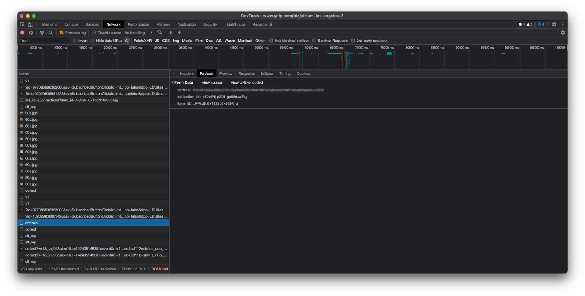
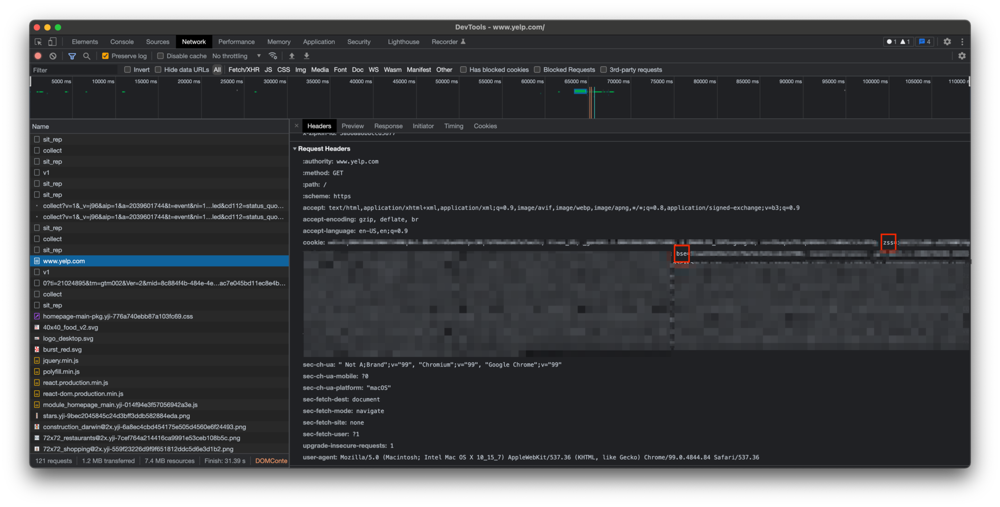
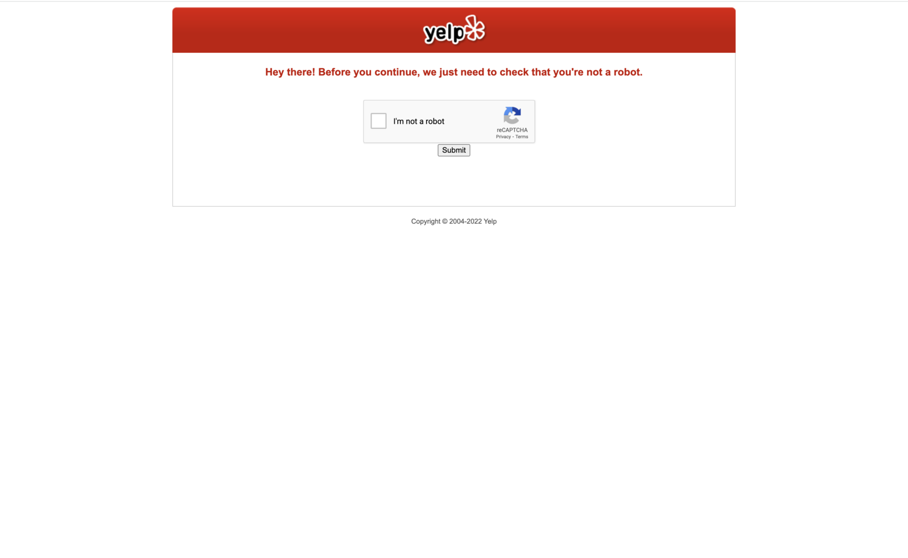

### Motivation

[Yelp Developers](https://www.yelp.com/developers) seems to offer a pretty
robust set of functionality for interacting with the Yelp platform. Yet it
confoundingly omits very basic operations for users to manage their data.

Waayy back in ye olde yonder year of 2014, I wrote a dumb [ruby script](https://github.com/cadizm/yelp/blob/dbbc097957f836d14707b67fb2784ebbb1b1501d/yelp.rb)
to download my Yelp bookmarks.  I have not maintained it since first writing
and I don't think it works anymore.

Fast-forward to 2022 and my "Bookmarks" (now renamed "Collections") have
ballooned in size to number ~3700. Yelp has also now provided the ability
to create supplemental collections in addition to the default (and non-
deletable) My Bookmarks.

I pretty much want to just start over and curate a more organized bookmark
collection. But alas Yelp does not provide an easy way to expunge a large set
of collection items in batch. I tried manually navigating to each business and
clicking "Remove", but that got old quickly.

Which brings us to this script which reverse-engineers Yelp's User Collection
API to do 3 things:

  1. Collect all of the bookmarks in a collection (in raw json as returned by
     Yelp)
  2. Transform the bookmarks them into a csv with (key, business name, url)
     columns
  3. Remove all the items in the collection programmatically using said csv

### Setup/Installation

```shell
$ git clone https://github.com/cadizm/yelp.git
$ cd yelp && python3 -m venv ${VENV_HOME}/yelp
$ source ${VENV_HOME}/yelp/bin/activate
$ pip install -r requirements.txt
```

### Usage

#### Prerequisite data

- `collection_id`: The string uniquely identifying the collection you want
to interact with. You can get this by logging into your Yelp account and
navigating: About Me -> Collections -> click on collection you want ->
look at the url and note the id. For example, in the following url:
https://www.yelp.com/collection/d61FFOkqEJI-hyV9etbFWh/My-Bookmarks
the collection id is `d61FFOkqEJI-hyV9etbFWh`.

- `csrftok`: The [CSRF token](https://en.wikipedia.org/wiki/Cross-site_request_forgery#Prevention)
you will need to provide when making requests that interact with Yelp user
collections. The easiest way to obtain this token is by logging into Yelp,
opening up [DevTools](https://developer.chrome.com/docs/devtools/), and
inspecting an api request that includes this (such as the remove operation).
A screenshot of this can be seen below.



- `zss` and `bse` cookies: The cookies you'll need to set in order to interact
with the Yelp api.  I have no idea what zss or bse stand for or mean, but by
trial and error, I know that they are needed in order for requests to be
auth'ed and accepted successfully. *NOTE*: cookies should be treated as PII
and have been redacted below accordingly.  Again, the easiest way to get these
values is to login into your account and use devtools to inspect the response
headers on any page.




#### Collect bookmark items

In a shell, navigate to this repo and do something like:

```shell
(yelp) $ python collect.py
Retrieving url with params: {'collection_id': 'c5OeENjpDIH-gxU8dsaEVg', 'sort_by': 'date', 'offset': 30}
```

The script will run for a while and write some json files to the `output` directory.

#### Parse json files into csv

After the collection stage has finished, you'll want to massage the json files into
a format that is more easily manipulated:

```shell
(yelp) $ python parse.py output/*.json
```

This command should run much more quickly than `collect.py` and produce an item csv
file in the current directory, something like `items-1648703471.csv`. The rows in
the csv are the items in your collection of the form: (key, name, and url).

#### Remove items from collection

After the parsing stage you are finally almost ready to remove all the things!! You
will first need to edit `remove.py` and fill in the information collected in during
the prerequisite stage. I.e. the `collection_id`, `csrftok`, and the `zss` and `bse`
cookies. Then you can run:

```shell
(yelp) $ python remove.py items-1648703927.csv
Removing Burgers Never Say Die with key 26fIBSlQkaTa29uoKAvZOw
Count remaining: 2335
```

### Caveats

First and foremost, realize that the usage described above could be a violation of the
Yelp Terms of Service. Please use responsibly and lawfully and read the [license](LICENSE.md)
before using. Also be a good netizen and do not hammer Yelp's servers. Note that Yelp
monitors its api's for "bot-like" behavior and presents captcha's accordingly:


